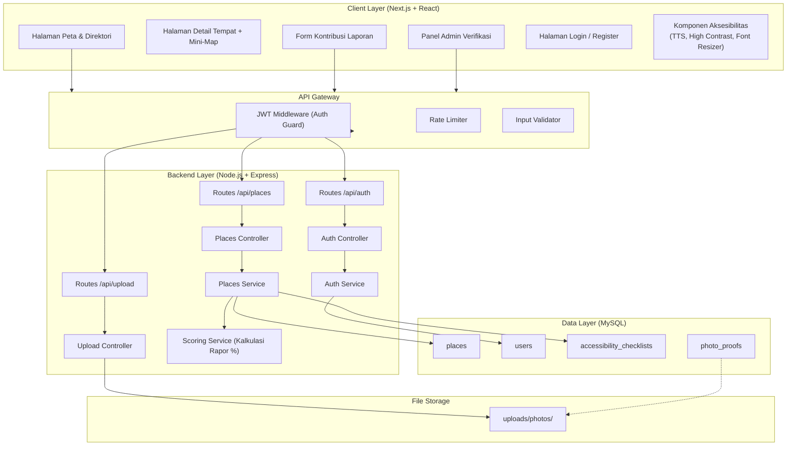
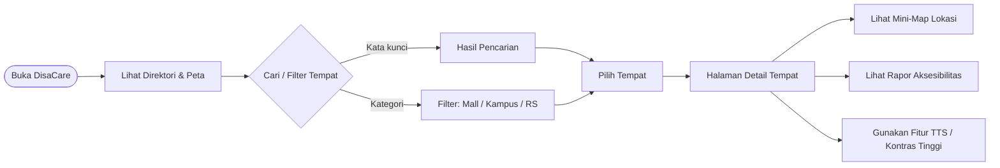
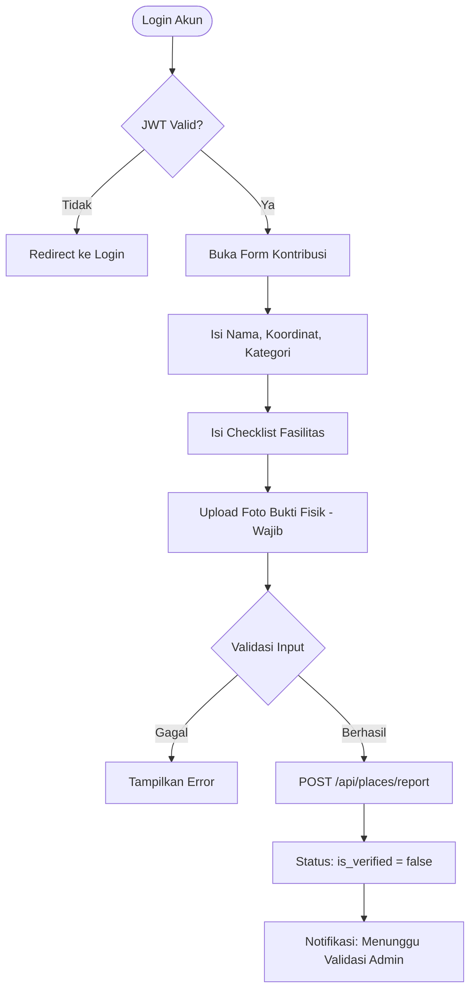
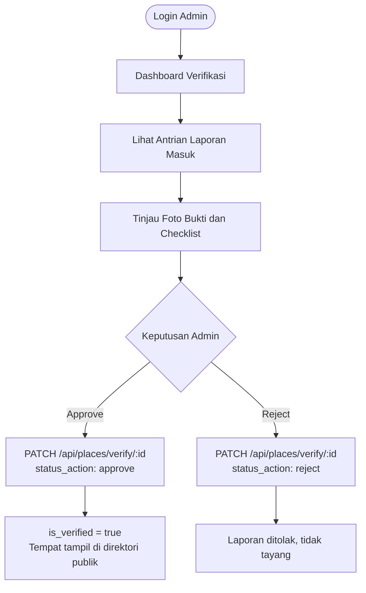
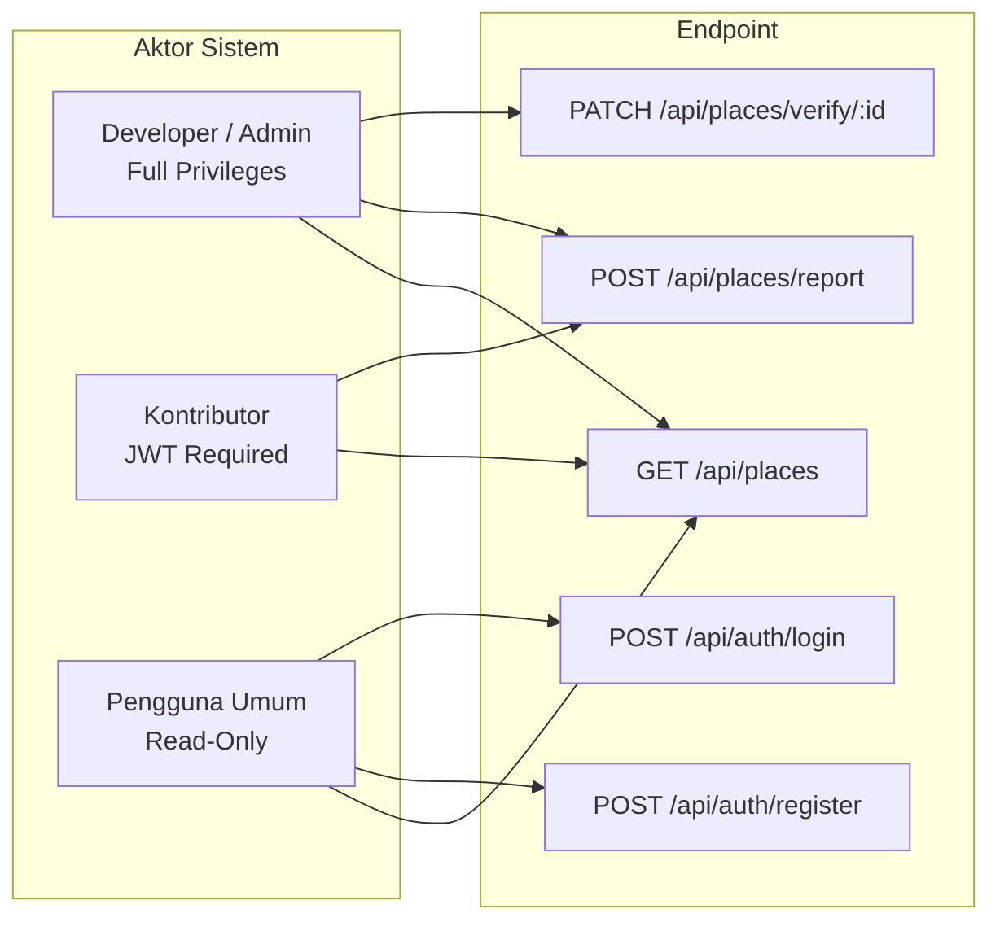

# DisaCare Bandung

Platform portal informasi dan direktori spasial aksesibilitas fasilitas publik di Kota Bandung bagi penyandang disabilitas.

---

## Daftar Isi

- [Gambaran Umum](#gambaran-umum)
- [Arsitektur Sistem](#arsitektur-sistem)
- [Workflow Aplikasi](#workflow-aplikasi)
- [Struktur Direktori](#struktur-direktori)
- [Tech Stack](#tech-stack)
- [Peran dan Hak Akses](#peran-dan-hak-akses)
- [Fitur Utama](#fitur-utama)
- [Cara Menjalankan](#cara-menjalankan)
- [Dokumentasi Lanjutan](#dokumentasi-lanjutan)

---

## Gambaran Umum

**DisaCare** adalah platform portal informasi berbasis web yang memetakan tingkat aksesibilitas fasilitas publik di wilayah Kota Bandung bagi penyandang disabilitas. Aplikasi ini menggunakan pendekatan data hibrida yang menggabungkan dua sumber data utama:

| Sumber Data | Keterangan |
|---|---|
| Official Data | Data terverifikasi yang dimasukkan langsung oleh Developer/Admin (contoh: Balai Kota Bandung, BIP, Gedung Sate, kampus-kampus) |
| Crowdsourced Data | Kontribusi laporan, checklist fasilitas, dan foto bukti fisik dari mahasiswa dan warga Bandung |

Platform ini juga dirancang secara inklusif dengan fitur aksesibilitas bawaan seperti Text-to-Speech, High Contrast Mode, dan Font Resizer agar dapat diakses langsung oleh penyandang disabilitas.

**Tim Pengembang**

| Nama | Peran |
|---|---|
| Affifah | ... |
| Alifya | ... |
| Al Yasmin | ... |
| Zahra | ... |

Mata Kuliah: Literasi Manusia
Lokasi Studi Kasus: Kota Bandung, Jawa Barat

---

## Arsitektur Sistem



---

## Workflow Aplikasi

### A. Alur Pengguna Umum (Read-Only)



### B. Alur Kontributor



### C. Alur Admin Verifikasi



---

## Struktur Direktori

```
disacare-bandung/
├── README.md
├── docs/
│   ├── prd-frontend.md
│   ├── prd-backend.md
│   └── prd-mock-server.md
│
├── frontend/
│   ├── app/
│   │   ├── (public)/
│   │   │   ├── page.tsx               -- Halaman utama direktori + peta
│   │   │   └── place/[id]/page.tsx    -- Halaman detail + mini-map
│   │   ├── (auth)/
│   │   │   ├── login/page.tsx
│   │   │   └── register/page.tsx
│   │   ├── contribute/page.tsx        -- Form kontribusi (protected)
│   │   └── admin/
│   │       ├── page.tsx               -- Dashboard verifikasi (protected)
│   │       └── verify/[id]/page.tsx
│   ├── components/
│   │   ├── map/                       -- Komponen Leaflet.js
│   │   ├── accessibility/             -- TTS, High Contrast, Font Resizer
│   │   ├── ui/                        -- Reusable UI
│   │   └── forms/
│   ├── lib/
│   │   ├── api.ts
│   │   └── auth.ts
│   └── public/
│
├── backend/
│   ├── src/
│   │   ├── routes/
│   │   │   ├── places.routes.js
│   │   │   ├── auth.routes.js
│   │   │   └── upload.routes.js
│   │   ├── controllers/
│   │   │   ├── places.controller.js
│   │   │   ├── auth.controller.js
│   │   │   └── upload.controller.js
│   │   ├── services/
│   │   │   ├── places.service.js
│   │   │   ├── auth.service.js
│   │   │   └── scoring.service.js
│   │   ├── middlewares/
│   │   │   ├── auth.middleware.js
│   │   │   └── upload.middleware.js
│   │   └── config/
│   │       ├── db.js
│   │       └── schema.sql
│   └── app.js
│
└── mock-server/
    ├── db.json
    └── routes.json
```

---

## Tech Stack

| Layer | Teknologi | Keterangan |
|---|---|---|
| Frontend Framework | Next.js 14 (App Router) | SSR dan routing berbasis file |
| UI Styling | Tailwind CSS | Utility-first CSS framework |
| Peta | Leaflet.js + OpenStreetMap | Library peta ringan, gratis, client-side |
| Backend | Node.js + Express.js | REST API server modular |
| Database | MySQL | Relational database |
| DB Driver | mysql2 | Koneksi MySQL tanpa ORM, query manual |
| Autentikasi | JWT (jsonwebtoken) | Stateless auth berbasis token |
| File Upload | Multer | Middleware penanganan foto bukti fisik |
| Aksesibilitas | Web Speech API (browser native) | Text-to-Speech tanpa dependency tambahan |
| Mock Server | json-server | Placeholder API untuk tahap development |

---

## Peran dan Hak Akses



| Role | Tanggung Jawab | Hak Akses |
|---|---|---|
| Developer / Admin | Input data resmi, validasi laporan foto | Full (semua endpoint) |
| Kontributor | Laporan tempat baru + foto bukti | Baca + kirim laporan (JWT) |
| Pengguna Umum | Cari tempat, baca rapor, gunakan fitur TTS | Read-Only, tanpa login |

---

## Fitur Utama

**1. Direktori Tempat + Mini-Map**
Pencarian dan filter tempat di Bandung berdasarkan kata kunci atau kategori (mall, kampus, rumah sakit, perkantoran). Setiap halaman detail tempat menyertakan mini-map Leaflet.js yang menampilkan satu titik koordinat lokasi.

**2. Rapor Aksesibilitas**
Setiap tempat memiliki persentase rapor yang dikalkulasi dari checklist fasilitas: ramp kursi roda, toilet ramah disabilitas, jalur guiding block, parkir khusus, pintu lebar/otomatis, dan akses lift.

**3. Fitur Aksesibilitas UI**
Dirancang untuk dapat diakses langsung oleh penyandang disabilitas:
- Text-to-Speech menggunakan Web Speech API untuk membacakan deskripsi tempat
- High Contrast Mode (tampilan hitam-kuning) untuk pengguna low vision
- Font Resizer untuk memperbesar ukuran teks

**4. Form Kontribusi Laporan**
Kontributor dapat mendaftarkan tempat baru dengan mengisi nama, koordinat, kategori, checklist fasilitas, dan foto bukti fisik (wajib).

**5. Panel Verifikasi Admin**
Admin meninjau foto bukti yang diunggah dan memutuskan approve atau reject. Hanya tempat yang disetujui yang tampil di direktori publik.

---

## Cara Menjalankan

### Prasyarat

- Node.js >= 18.x
- MySQL >= 8.x
- npm

### Langkah Instalasi

```bash
# 1. Clone repository
git clone https://github.com/your-org/disacare-bandung.git
cd disacare-bandung

# 2. Install dependensi backend
cd backend && npm install

# 3. Install dependensi frontend
cd ../frontend && npm install
```

### Konfigurasi Environment

```bash
# backend/.env
DB_HOST=localhost
DB_PORT=3306
DB_USER=root
DB_PASSWORD=yourpassword
DB_NAME=disacare_db
JWT_SECRET=your_super_secret_key
JWT_EXPIRES_IN=7d
PORT=5000
UPLOAD_PATH=./uploads

# frontend/.env.local
NEXT_PUBLIC_API_URL=http://localhost:5000
NEXT_PUBLIC_MAP_CENTER_LAT=-6.914744
NEXT_PUBLIC_MAP_CENTER_LNG=107.609810
```

### Inisialisasi Database

```bash
cd backend
mysql -u root -p < src/config/schema.sql
```

### Menjalankan Aplikasi

```bash
# Terminal 1: Backend API
cd backend && npm run dev

# Terminal 2: Frontend
cd frontend && npm run dev

# Terminal 3 (opsional): Mock Server untuk development
cd mock-server && npx json-server db.json --port 3001
```

### URL Akses

| Service | URL |
|---|---|
| Frontend | http://localhost:3000 |
| Backend API | http://localhost:5000 |
| Mock Server | http://localhost:3001 |

---

## Batasan Scope

DisaCare **tidak** menyediakan navigasi rute jalan (turn-by-turn navigation). Fokus aplikasi adalah sebagai direktori informasi kelayakan fasilitas di lokasi tujuan, bukan penunjuk arah.

---

## Dokumentasi Lanjutan

| Dokumen | Deskripsi |
|---|---|
| `docs/prd-frontend.md` | PRD Frontend: halaman, komponen, state management, aksesibilitas UI |
| `docs/prd-backend.md` | PRD Backend: API contract lengkap, SQL schema, service logic |
| `docs/prd-mock-server.md` | PRD Mock Server: struktur db.json, endpoint simulasi |

---

*DisaCare Bandung — Tugas Besar Mata Kuliah Literasi Manusia dan Teknologi*
*Tim: Affifah, Alifya, Al Yasmin, Zahra*
