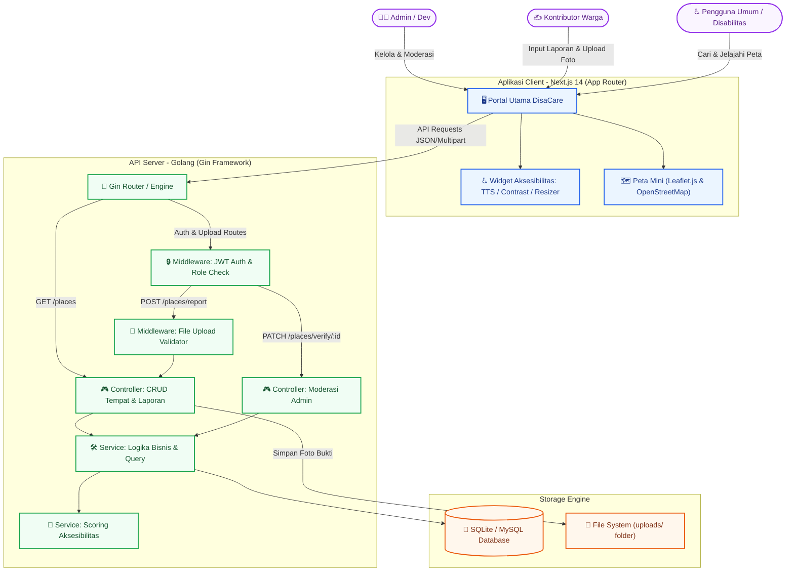
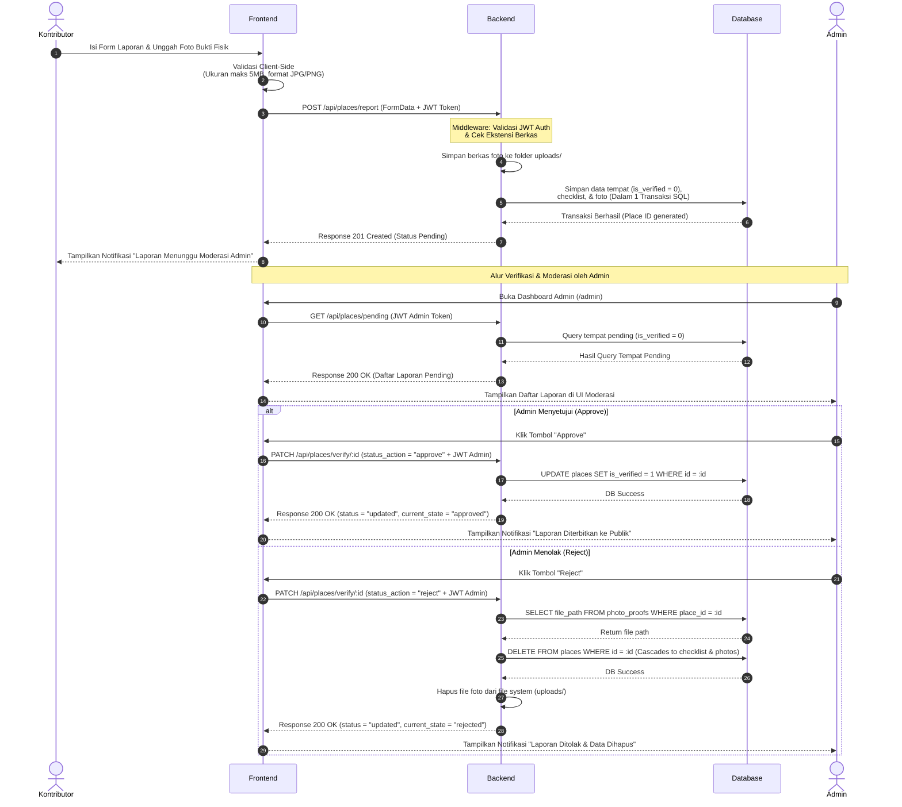

# DisaCare Bandung

Portal Informasi Aksesibilitas Spasial Ramah Disabilitas Kota Bandung

Sebuah sistem informasi berbasis peta (Map-Based Information System) dengan pendekatan Hybrid Data Sourcing dan standar aksesibilitas inklusif (WCAG) untuk memetakan fasilitas publik ramah disabilitas di Bandung.

---

## Daftar Isi

- [Deskripsi Proyek](#1-deskripsi-proyek)
- [Aktor dan Hak Akses (Role Matrix)](#2-aktor-dan-hak-akses-role-matrix)
- [Arsitektur Sistem](#3-arsitektur-sistem)
- [Alur Kerja Kontribusi Tempat (Workflow IPO)](#4-alur-kerja-kontribusi-tempat-workflow-ipo)
- [Teknologi yang Digunakan](#5-teknologi-yang-digunakan)
- [Aturan Teknis Proyek](#6-aturan-teknis-proyek)
- [Struktur Direktori](#7-struktur-direktori)
- [Cara Menjalankan](#8-cara-menjalankan)
- [Tim Pengembang](#9-tim-pengembang)

---

## 1. Deskripsi Proyek

DisaCare Bandung dirancang untuk membantu penyandang disabilitas (fisik, netra, rungu, dan lainnya) dalam menemukan dan menilai aksesibilitas fasilitas publik di Kota Bandung. Proyek ini menggunakan arsitektur modern berbasis Golang pada sisi backend, basis data relasional SQL (SQLite secara bawaan untuk pengembangan, serta dukungan MySQL), serta antarmuka web interaktif berbasis Next.js (React.js) dan Leaflet.js untuk performa yang optimal tanpa ketergantungan pada API berbayar.

**Fitur Kunci**

- **Peta Interaktif Bebas Biaya**: Visualisasi lokasi fasilitas menggunakan Leaflet.js dan OpenStreetMap.
- **Hybrid Data Sourcing**: Menggabungkan data primer resmi (Official Data) dengan data kontribusi komunitas (Crowdsourced Data).
- **Sistem Validasi Bukti Fisik (Anti-Hoax)**: Kontributor wajib menyertakan foto bukti fisik yang dikurasi ketat oleh administrator sebelum diterbitkan secara publik.
- **Web Accessibility (Ramah Inklusi)**: Penerapan standar Web Content Accessibility Guidelines (WCAG) seperti fitur pengubah kontras warna (high-contrast mode), penyesuaian ukuran font, dan pembaca teks (text-to-speech / screen reader).

---

## 2. Aktor dan Hak Akses (Role Matrix)

Sistem ini mengamankan dan mengontrol akses data dengan membaginya ke dalam tiga tingkat otorisasi.

| Peran (Role) | Hak Akses Utama | Deskripsi Logika Bisnis |
|---|---|---|
| **System Admin / Developer** | READ, WRITE, UPDATE, DELETE | Memiliki kontrol penuh, mengelola basis data primer, serta melakukan kurasi (approval/reject) terhadap laporan masuk dari kontributor. |
| **Kontributor (Warga/Mahasiswa)** | READ, WRITE (Terbatas) | Pengguna terdaftar (terotentikasi via JWT) yang berhak menambahkan ulasan, melaporkan fasilitas baru, mengisi checklist penilaian, dan mengunggah foto bukti fisik. |
| **Pengguna Umum / Disabilitas** | READ saja | Pengguna publik yang dapat mencari tempat, membaca ulasan, menggunakan peta, serta mengaktifkan fitur aksesibilitas tanpa harus melakukan registrasi atau login. |

---

## 3. Arsitektur Sistem

Desain arsitektur berikut menggambarkan pemisahan tugas yang jelas (*Separation of Concerns*) antara antarmuka pengguna, gerbang keamanan API (middleware), mesin pemroses logika (Golang Engine), hingga penyimpanan basis data relasional dan sistem berkas.



---

## 4. Alur Kerja Kontribusi Tempat (Workflow IPO)

Alur berikut memetakan bagaimana data laporan dari kontributor diproses, divalidasi, disimpan, hingga melalui alur moderasi admin (persetujuan atau penolakan) sebelum ditayangkan secara publik.



---

## 5. Teknologi yang Digunakan

Aplikasi ini dibangun menggunakan tumpukan teknologi berikut demi menjamin performa, keamanan, dan keandalan sistem.

**Antarmuka (Frontend)**

| Teknologi | Peran |
|---|---|
| Next.js 14 / React.js | Framework utama frontend (App Router) |
| Tailwind CSS | Efisiensi styling dengan utility class |
| Leaflet.js + OpenStreetMap | Sistem pemetaan gratis dan sumber terbuka |
| Web Speech API | Fungsi Text-to-Speech bawaan peramban |

**Logika Bisnis (Backend)**

| Teknologi | Peran |
|---|---|
| Golang (Go) | Bahasa utama backend dengan performa tinggi |
| Gin Framework | Router HTTP dan middleware handler |
| JWT (JSON Web Token) | Sistem otentikasi stateless |

**Penyimpanan Data (Database)**

| Teknologi | Peran |
|---|---|
| SQLite | Basis data relasional bawaan (sangat ringan untuk pengembangan lokal) |
| MySQL | Dukungan basis data relasional skala produksi |

---

## 6. Aturan Teknis Proyek

Untuk memenuhi standar pengembangan perangkat lunak yang baik dan aman, proyek ini menerapkan aturan-aturan berikut.

**Pola IPO (Input-Proses-Output) Konsisten**
Setiap penanganan permintaan (request handling) di backend wajib memisahkan validasi parameter (input), eksekusi logika di service layer (process), dan pengiriman data murni berformat JSON (output).

**Kemandirian Finansial API**
Tidak menggunakan platform peta berbayar yang memerlukan kunci API dengan billing setup. Seluruh peta mengandalkan integrasi OpenStreetMap.

**Modul Terpisah (Clean Architecture)**
Kode backend dilarang ditulis menumpuk dalam satu file besar. Pembagian folder wajib memisahkan berkas konfigurasi database, router, middleware, controller, model, dan database service.

**Validasi Berkas**
Pengunggahan gambar untuk bukti kontribusi wajib divalidasi ekstensi serta ukurannya pada sisi client dan server demi mencegah serangan injeksi berkas berbahaya.

---

## 7. Struktur Direktori

```
disacare-bandung/
├── README.md
├── dokumen/                          -- Dokumen PRD
│   ├── prd-frontend.md
│   ├── prd-backend.md
│   └── prd-mock-server.md
│
├── backend/                          -- Golang service
│   ├── main.go
│   ├── go.mod
│   ├── go.sum
│   ├── config/
│   │   ├── database.go               -- Koneksi SQLite/MySQL
│   │   ├── schema.sql                -- Skema DDL Database MySQL
│   │   └── seeder.go                 -- Inisialisasi skema & data demo SQLite
│   ├── middleware/
│   │   ├── auth.go                   -- JWT verification middleware
│   │   └── upload.go                 -- File upload validation
│   ├── controller/
│   │   ├── place_controller.go       -- Handler CRUD tempat
│   │   ├── auth_controller.go        -- Handler login/register
│   │   └── verify_controller.go      -- Handler moderasi admin
│   ├── model/
│   │   ├── place.go                  -- Struct model tabel places
│   │   ├── user.go                   -- Struct model tabel users
│   │   └── checklist.go              -- Struct model tabel checklist
│   ├── router/
│   │   └── router.go                 -- Definisi semua rute API
│   ├── service/
│   │   ├── place_service.go          -- Logika bisnis tempat
│   │   ├── auth_service.go           -- Logika bisnis autentikasi
│   │   └── scoring_service.go        -- Kalkulasi rapor aksesibilitas
│   └── uploads/                      -- Direktori foto bukti fisik
│
├── frontend/                         -- Next.js 14 client (App Router)
│   ├── package.json
│   ├── package-lock.json
│   ├── next.config.ts
│   ├── tsconfig.json
│   ├── app/
│   │   ├── layout.tsx                -- Root layout (Navbar, Footer, A11yBar)
│   │   ├── page.tsx                  -- Beranda utama (Direktori & Peta)
│   │   ├── (auth)/
│   │   │   ├── login/
│   │   │   │   └── page.tsx          -- Halaman Login
│   │   │   └── register/
│   │   │       └── page.tsx          -- Halaman Registrasi
│   │   ├── place/
│   │   │   └── [id]/
│   │   │       └── page.tsx          -- Detail Fasilitas & TTS
│   │   ├── contribute/
│   │   │   └── page.tsx              -- Form Laporan (Protected)
│   │   └── admin/
│   │       ├── page.tsx              -- Dashboard Antrian Admin
│   │       └── verify/
│   │           └── [id]/
│   │               └── page.tsx      -- Halaman Moderasi
│   ├── components/                   -- Reusable UI Components
│   └── lib/                          -- Client utilities (API client, context)
│
└── mock-server/                      -- Mock API untuk UI development
    ├── db.json
    ├── routes.json
    └── package.json
```

---

## 8. Cara Menjalankan

### A. Backend Server

1. Masuk ke direktori backend:
   ```bash
   cd backend
   ```
2. Salin berkas environment dan konfigurasikan (secara bawaan berkas `.env` sudah terkonfigurasi menggunakan SQLite):
   ```bash
   # Di Linux/macOS:
   cp .env.example .env (jika belum ada)
   
   # Di Windows (PowerShell):
   Copy-Item .env.example .env (jika belum ada)
   ```
   *Catatan: Repositori lokal ini sudah menyediakan berkas `.env` bawaan yang siap pakai menggunakan SQLite (`disacare.db`).*
3. Instal dependensi dan jalankan server Go:
   ```bash
   go mod tidy
   go run main.go
   ```
   *Saat pertama kali dijalankan, sistem akan otomatis membuat berkas database SQLite `disacare.db`, menginisialisasi tabel-tabel yang diperlukan, dan melakukan seeding data demo.*

4. **Kredensial Akun Demo (Default Seed)**:
   - **Akun Admin**:
     - Email: `admin@disacare.id`
     - Password: `adminpassword123`
   - **Akun Kontributor**:
     - Email: `contributor@disacare.id`
     - Password: `contributorpassword123`

### B. Frontend Server

1. Masuk ke direktori frontend:
   ```bash
   cd ../frontend
   ```
2. Instal dependensi:
   ```bash
   npm install
   ```
3. Jalankan server Next.js:
   ```bash
   npm run dev
   ```
4. Buka [http://localhost:3000](http://localhost:3000) pada peramban Anda.

### C. Mock Server (Alternatif Tanpa Database)

1. Masuk ke direktori mock-server:
   ```bash
   cd ../mock-server
   ```
2. Jalankan mock server:
   ```bash
   npm run mock
   ```
3. Ubah variabel `NEXT_PUBLIC_API_URL` di frontend `.env` Anda menjadi `http://localhost:3001` untuk menyambungkan antarmuka ke mock server.

---

## 9. Tim Pengembang

| Nama | Peran |
|---|---|
| **Affifah** | Frontend Developer & UI/UX Specialist |
| **Alifya** | Fullstack Developer & Technical Lead |
| **Al Yasmin** | Frontend Developer & Accessibility Specialist (WCAG) |
| **Zahra** | Backend Developer & Database Administrator |

**Mata Kuliah**: Literasi Manusia dan Teknologi  
**Studi Kasus**: Kota Bandung, Jawa Barat  

---

*Batasan scope: DisaCare tidak menyediakan navigasi rute jalan (turn-by-turn navigation). Fokus aplikasi adalah sebagai direktori informasi kelayakan fasilitas di lokasi tujuan, bukan penunjuk arah.*