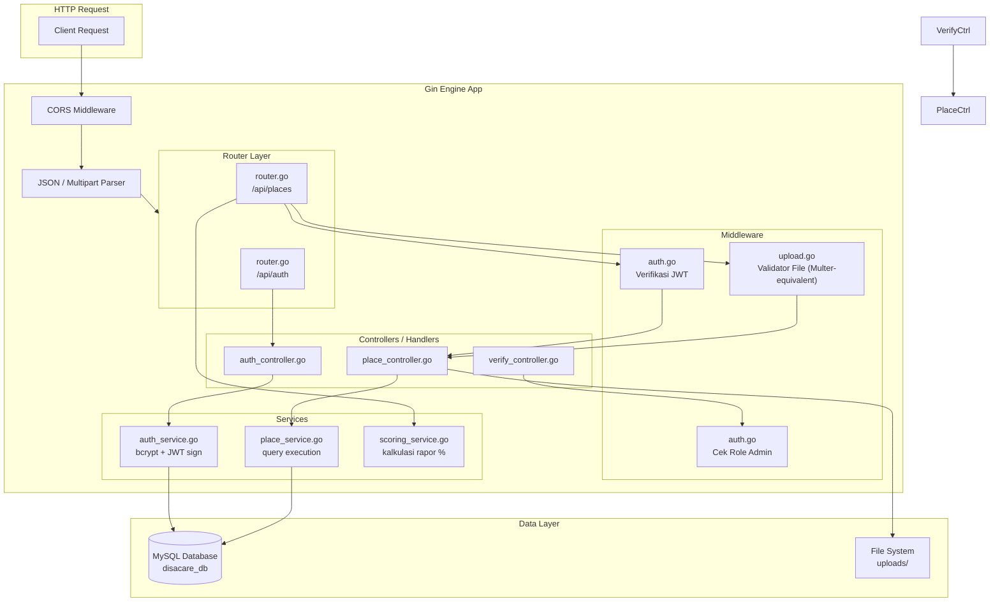
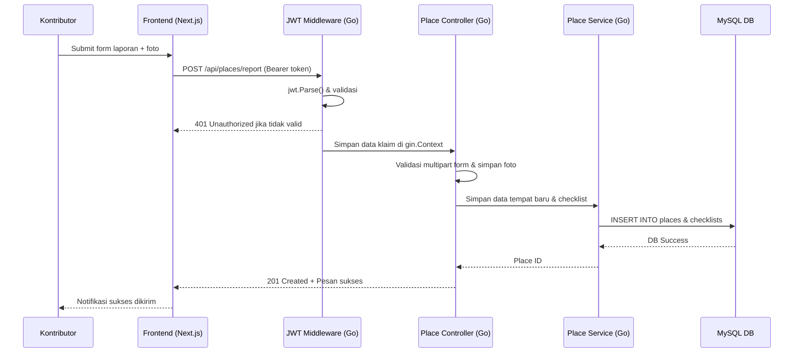
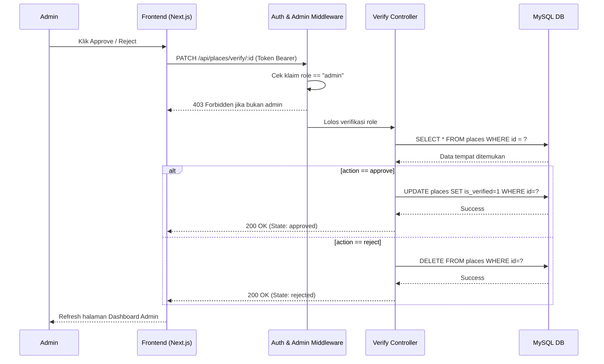

# PRD Backend — DisaCare Bandung

**Dokumen**: Product Requirements Document — Backend Layer  
**Aplikasi**: DisaCare Bandung  
**Stack**: Golang + Gin Framework + MySQL/PostgreSQL  
**Versi**: 1.0.0  
**Tim**: Affifah, Alifya, Al Yasmin, Zahra  

---

## Daftar Isi

- [Tujuan Dokumen](#tujuan-dokumen)
- [Arsitektur Backend](#arsitektur-backend)
- [SQL Schema](#sql-schema)
- [API Contract Lengkap](#api-contract-lengkap)
- [Middleware](#middleware)
- [Service Logic](#service-logic)
- [Struktur File Backend](#struktur-file-backend)
- [Konfigurasi Environment](#konfigurasi-environment)
- [Error Handling](#error-handling)
- [Workflow Diagram](#workflow-diagram)

---

## Tujuan Dokumen

Dokumen ini mendefinisikan seluruh kebutuhan teknis lapisan backend DisaCare Bandung berbasis bahasa pemrograman **Golang (Go)** dengan router **Gin Framework**. Dokumen ini mencakup desain database relasional (SQL schema lengkap), API contract untuk setiap endpoint, logika bisnis service, konfigurasi middleware JWT dan upload, serta panduan struktur kode.

---

## Arsitektur Backend



---

## SQL Schema

### Script Lengkap: `src/config/schema.sql`

```sql
-- ============================================================
-- DisaCare Bandung — Database Schema
-- Engine: MySQL 8.x / PostgreSQL
-- Charset: utf8mb4
-- ============================================================

CREATE DATABASE IF NOT EXISTS disacare_db
  CHARACTER SET utf8mb4
  COLLATE utf8mb4_unicode_ci;

USE disacare_db;

-- ------------------------------------------------------------
-- Tabel: users
-- Menyimpan data akun kontributor dan admin
-- ------------------------------------------------------------
CREATE TABLE IF NOT EXISTS users (
  id            CHAR(36)        NOT NULL,
  name          VARCHAR(100)    NOT NULL,
  email         VARCHAR(150)    NOT NULL UNIQUE,
  password_hash VARCHAR(255)    NOT NULL,
  role          ENUM('admin', 'contributor') NOT NULL DEFAULT 'contributor',
  created_at    TIMESTAMP       NOT NULL DEFAULT CURRENT_TIMESTAMP,
  updated_at    TIMESTAMP       NOT NULL DEFAULT CURRENT_TIMESTAMP ON UPDATE CURRENT_TIMESTAMP,

  PRIMARY KEY (id),
  INDEX idx_users_email (email),
  INDEX idx_users_role  (role)
) ENGINE=InnoDB DEFAULT CHARSET=utf8mb4;


-- ------------------------------------------------------------
-- Tabel: places
-- Menyimpan data tempat resmi maupun kontribusi komunitas
-- ------------------------------------------------------------
CREATE TABLE IF NOT EXISTS places (
  id            CHAR(36)        NOT NULL,
  name          VARCHAR(200)    NOT NULL,
  category      ENUM(
                  'mall',
                  'kampus',
                  'rumah_sakit',
                  'kantor_pemerintah',
                  'taman',
                  'stasiun',
                  'lainnya'
                ) NOT NULL DEFAULT 'lainnya',
  address       TEXT            NOT NULL,
  latitude      DECIMAL(10, 8)  NOT NULL,
  longitude     DECIMAL(11, 8)  NOT NULL,
  description   TEXT            NULL,
  data_source   ENUM('official', 'user_contributed') NOT NULL DEFAULT 'user_contributed',
  is_verified   TINYINT(1)      NOT NULL DEFAULT 0,
  verified_at   TIMESTAMP       NULL DEFAULT NULL,
  verified_by   CHAR(36)        NULL DEFAULT NULL,
  contributed_by CHAR(36)       NULL DEFAULT NULL,
  created_at    TIMESTAMP       NOT NULL DEFAULT CURRENT_TIMESTAMP,
  updated_at    TIMESTAMP       NOT NULL DEFAULT CURRENT_TIMESTAMP ON UPDATE CURRENT_TIMESTAMP,

  PRIMARY KEY (id),
  INDEX idx_places_category    (category),
  INDEX idx_places_is_verified (is_verified),
  INDEX idx_places_data_source (data_source),
  FULLTEXT INDEX ft_places_name_address (name, address),

  CONSTRAINT fk_places_verified_by
    FOREIGN KEY (verified_by) REFERENCES users(id) ON DELETE SET NULL,
  CONSTRAINT fk_places_contributed_by
    FOREIGN KEY (contributed_by) REFERENCES users(id) ON DELETE SET NULL
) ENGINE=InnoDB DEFAULT CHARSET=utf8mb4;


-- ------------------------------------------------------------
-- Tabel: accessibility_checklists
-- Menyimpan detail checklist fasilitas per tempat (one-to-one)
-- ------------------------------------------------------------
CREATE TABLE IF NOT EXISTS accessibility_checklists (
  id                  CHAR(36)    NOT NULL,
  place_id            CHAR(36)    NOT NULL UNIQUE,
  has_ramp            TINYINT(1)  NOT NULL DEFAULT 0, -- Ramp / jalur landai kursi roda
  has_disability_toilet TINYINT(1) NOT NULL DEFAULT 0, -- Toilet ramah disabilitas
  has_guiding_block   TINYINT(1)  NOT NULL DEFAULT 0, -- Jalur pemandu tunanetra
  has_parking         TINYINT(1)  NOT NULL DEFAULT 0, -- Area parkir khusus disabilitas
  has_wide_door       TINYINT(1)  NOT NULL DEFAULT 0, -- Pintu otomatis atau lebar
  has_elevator        TINYINT(1)  NOT NULL DEFAULT 0, -- Lift atau akses vertikal
  created_at          TIMESTAMP   NOT NULL DEFAULT CURRENT_TIMESTAMP,
  updated_at          TIMESTAMP   NOT NULL DEFAULT CURRENT_TIMESTAMP ON UPDATE CURRENT_TIMESTAMP,

  PRIMARY KEY (id),
  INDEX idx_checklist_place_id (place_id),

  CONSTRAINT fk_checklist_place
    FOREIGN KEY (place_id) REFERENCES places(id) ON DELETE CASCADE
) ENGINE=InnoDB DEFAULT CHARSET=utf8mb4;


-- ------------------------------------------------------------
-- Tabel: photo_proofs
-- Menyimpan metadata foto bukti fisik per tempat (one-to-many)
-- ------------------------------------------------------------
CREATE TABLE IF NOT EXISTS photo_proofs (
  id            CHAR(36)        NOT NULL,
  place_id      CHAR(36)        NOT NULL,
  uploaded_by   CHAR(36)        NULL,
  file_name     VARCHAR(255)    NOT NULL,
  file_path     VARCHAR(500)    NOT NULL,
  file_size     INT UNSIGNED    NOT NULL COMMENT 'Ukuran file dalam bytes',
  mime_type     VARCHAR(50)     NOT NULL,
  created_at    TIMESTAMP       NOT NULL DEFAULT CURRENT_TIMESTAMP,

  PRIMARY KEY (id),
  INDEX idx_photo_place_id (place_id),

  CONSTRAINT fk_photo_place
    FOREIGN KEY (place_id) REFERENCES places(id) ON DELETE CASCADE,
  CONSTRAINT fk_photo_uploader
    FOREIGN KEY (uploaded_by) REFERENCES users(id) ON DELETE SET NULL
) ENGINE=InnoDB DEFAULT CHARSET=utf8mb4;
```

---

## API Contract Lengkap

### Base URL

```
http://localhost:8080/api
```

### Header Standar

| Header | Nilai | Kapan |
|---|---|---|
| Content-Type | application/json | Semua request JSON |
| Content-Type | multipart/form-data | Request upload foto kontribusi |
| Authorization | Bearer {JWT_TOKEN} | Endpoint terproteksi |

---

### AUTH ENDPOINTS

#### POST /api/auth/register

Mendaftarkan akun kontributor baru.

- **Access**: Public
- **Request Body (JSON)**:
```json
{
  "name": "Budi Santoso",
  "email": "budi@example.com",
  "password": "password123"
}
```
- **Validasi**:
  - `name`: string, wajib, min 2 karakter
  - `email`: string, wajib, format email valid, unik
  - `password`: string, wajib, min 8 karakter
- **Response 201 Created**:
```json
{
  "status": "success",
  "message": "Akun berhasil dibuat",
  "data": {
    "id": "550e8400-e29b-41d4-a716-446655440000",
    "name": "Budi Santoso",
    "email": "budi@example.com",
    "role": "contributor"
  }
}
```
- **Response 400 Bad Request**:
```json
{
  "status": "error",
  "message": "Email sudah terdaftar"
}
```

---

#### POST /api/auth/login

Login dan mendapatkan JWT token.

- **Access**: Public
- **Request Body (JSON)**:
```json
{
  "email": "budi@example.com",
  "password": "password123"
}
```
- **Response 200 OK**:
```json
{
  "status": "success",
  "message": "Login berhasil",
  "data": {
    "token": "eyJhbGciOiJIUzI1NiIsInR5cCI6IkpXVCJ9...",
    "user": {
      "id": "550e8400-e29b-41d4-a716-446655440000",
      "name": "Budi Santoso",
      "email": "budi@example.com",
      "role": "contributor"
    }
  }
}
```
- **Response 401 Unauthorized**:
```json
{
  "status": "error",
  "message": "Email atau password salah"
}
```

---

### PLACES ENDPOINTS

#### GET /api/places

Mengambil daftar semua tempat terverifikasi dengan opsional pencarian dan filter.

- **Access**: Public
- **Query Parameters**:
  - `search_query`: string (opsional, kata kunci nama tempat atau jalan)
  - `category_filter`: string (opsional, mall, kampus, rumah_sakit, dll.)
- **Response 200 OK**:
```json
{
  "status": "success",
  "data": [
    {
      "id": "550e8400-e29b-41d4-a716-446655440001",
      "name": "Gedung Sate",
      "category": "kantor_pemerintah",
      "address": "Jl. Diponegoro No.22, Citarum, Kec. Bandung Wetan, Kota Bandung",
      "latitude": -6.902,
      "longitude": 107.6186,
      "accessibility_score": 83.33,
      "is_verified": true,
      "data_source": "official",
      "primary_photo": "/uploads/gedung-sate-001.jpg",
      "checklist": {
        "has_ramp": true,
        "has_disability_toilet": true,
        "has_guiding_block": true,
        "has_parking": true,
        "has_wide_door": true,
        "has_elevator": false
      }
    }
  ],
  "meta": {
    "total": 1,
    "search_query": "gedung sate",
    "category_filter": "kantor_pemerintah"
  }
}
```

---

#### GET /api/places/:id

Mengambil detail satu tempat beserta checklist dan foto.

- **Access**: Public
- **Path Parameter**: `id` — UUID tempat
- **Response 200 OK**:
```json
{
  "status": "success",
  "data": {
    "id": "550e8400-e29b-41d4-a716-446655440001",
    "name": "Gedung Sate",
    "category": "kantor_pemerintah",
    "address": "Jl. Diponegoro No.22, Citarum, Kec. Bandung Wetan, Kota Bandung",
    "latitude": -6.902,
    "longitude": 107.6186,
    "description": "Gedung bersejarah yang berfungsi sebagai kantor Gubernur Jawa Barat.",
    "accessibility_score": 83.33,
    "is_verified": true,
    "verified_at": "2024-01-15T10:30:00Z",
    "data_source": "official",
    "checklist": {
      "has_ramp": true,
      "has_disability_toilet": true,
      "has_guiding_block": true,
      "has_parking": true,
      "has_wide_door": true,
      "has_elevator": false
    },
    "photos": [
      {
        "id": "photo-uuid-001",
        "file_path": "/uploads/gedung-sate-001.jpg",
        "created_at": "2024-01-15T10:30:00Z"
      }
    ]
  }
}
```

---

#### POST /api/places/official

Menambahkan data tempat resmi secara langsung. Hanya dapat diakses oleh admin.

- **Access**: Protected — Admin
- **Request Body (JSON)**:
```json
{
  "name": "Balai Kota Bandung",
  "category": "kantor_pemerintah",
  "address": "Jl. Wastukancana No.2, Babakan Ciamis, Kec. Sumur Bandung, Kota Bandung",
  "latitude": -6.9147,
  "longitude": 107.6098,
  "description": "Kantor Wali Kota Bandung yang telah menyediakan berbagai fasilitas disabilitas.",
  "checklist": {
    "has_ramp": true,
    "has_disability_toilet": true,
    "has_guiding_block": false,
    "has_parking": true,
    "has_wide_door": true,
    "has_elevator": true
  }
}
```
- **Response 201 Created**:
```json
{
  "status": "success",
  "message": "Data tempat resmi berhasil ditambahkan",
  "data": {
    "id": "new-place-uuid",
    "name": "Balai Kota Bandung",
    "accessibility_score": 83.33,
    "is_verified": true,
    "data_source": "official"
  }
}
```

---

#### POST /api/places/report

Kontributor mengirim laporan tempat baru disertai foto bukti fisik.

- **Access**: Protected — Contributor / Admin
- **Request**: `multipart/form-data`
- **Fields**:
  - `place_name`: string (Ya)
  - `category`: string (Ya)
  - `address`: string (Ya)
  - `latitude`: number (Ya)
  - `longitude`: number (Ya)
  - `description`: string (Tidak)
  - `has_ramp`: boolean (Ya)
  - `has_disability_toilet`: boolean (Ya)
  - `has_guiding_block`: boolean (Ya)
  - `has_parking`: boolean (Ya)
  - `has_wide_door`: boolean (Ya)
  - `has_elevator`: boolean (Ya)
  - `image_proof`: file (Ya, foto bukti fisik, jpg/png, maks 5MB)
- **Response 201 Created**:
```json
{
  "status": "success",
  "message": "Laporan tempat berhasil disimpan, menunggu validasi foto oleh admin",
  "data": {
    "id": "new-place-uuid",
    "name": "Kedai Kopi Inklusif",
    "is_verified": false,
    "data_source": "user_contributed"
  }
}
```

---

#### PATCH /api/places/verify/:id

Admin menyetujui atau menolak laporan kontributor.

- **Access**: Protected — Admin
- **Path Parameter**: `id` — UUID tempat
- **Request Body (JSON)**:
```json
{
  "status_action": "approve"
}
```
*Note: `status_action` harus bernilai `approve` atau `reject`.*

- **Response 200 OK (Approve)**:
```json
{
  "status": "updated",
  "message": "Laporan berhasil disetujui dan kini tampil di direktori publik",
  "data": {
    "id": "place-uuid",
    "is_verified": true,
    "verified_at": "2024-06-06T08:00:00Z",
    "current_verification_state": "approved"
  }
}
```
- **Response 200 OK (Reject)**:
```json
{
  "status": "updated",
  "message": "Laporan ditolak dan dihapus dari sistem",
  "data": {
    "id": "place-uuid",
    "current_verification_state": "rejected"
  }
}
```

---

#### GET /api/places/pending

Mengambil daftar laporan yang menunggu verifikasi admin.

- **Access**: Protected — Admin
- **Response 200 OK**:
```json
{
  "status": "success",
  "data": [
    {
      "id": "place-uuid",
      "name": "Kedai Kopi Inklusif",
      "category": "lainnya",
      "address": "Jl. Riau No. 10, Bandung",
      "created_at": "2024-06-05T14:30:00Z",
      "contributor_name": "Budi Santoso",
      "contributor_email": "budi@example.com",
      "proof_photo": "/uploads/kedai-kopi-001.jpg"
    }
  ],
  "meta": {
    "total_pending": 1
  }
}
```

---

## Middleware

### 1. auth.go (JWT Auth Middleware)

Implementasi JWT auth di Golang dengan menggunakan library `github.com/golang-jwt/jwt/v5` pada middleware Gin.

```go
package middleware

import (
	"net/http"
	"strings"
	"github.com/gin-gonic/gin"
	"github.com/golang-jwt/jwt/v5"
)

func AuthMiddleware(jwtSecret string) gin.HandlerFunc {
	return func(c *gin.Context) {
		authHeader := c.GetHeader("Authorization")
		if authHeader == "" {
			c.JSON(http.StatusUnauthorized, gin.H{"status": "error", "message": "Token tidak ditemukan"})
			c.Abort()
			return
		}

		parts := strings.Split(authHeader, " ")
		if len(parts) != 2 || parts[0] != "Bearer" {
			c.JSON(http.StatusUnauthorized, gin.H{"status": "error", "message": "Format token tidak valid"})
			c.Abort()
			return
		}

		tokenStr := parts[1]
		token, err := jwt.Parse(tokenStr, func(token *jwt.Token) (interface{}, error) {
			return []byte(jwtSecret), nil
		})

		if err != nil || !token.Valid {
			c.JSON(http.StatusUnauthorized, gin.H{"status": "error", "message": "Token tidak valid atau kedaluwarsa"})
			c.Abort()
			return
		}

		claims, ok := token.Claims.(jwt.MapClaims)
		if !ok {
			c.JSON(http.StatusUnauthorized, gin.H{"status": "error", "message": "Klaim token tidak valid"})
			c.Abort()
			return
		}

		c.Set("userID", claims["id"])
		c.Set("userRole", claims["role"])
		c.Set("userName", claims["name"])
		c.Set("userEmail", claims["email"])
		c.Next()
	}
}

func RequireAdmin() gin.HandlerFunc {
	return func(c *gin.Context) {
		role, exists := c.Get("userRole")
		if !exists || role != "admin" {
			c.JSON(http.StatusForbidden, gin.H{"status": "error", "message": "Akses ditolak. Hanya admin yang diizinkan"})
			c.Abort()
			return
		}
		c.Next()
	}
}
```

---

### 2. upload.go (File Upload Validator)

Validasi file di sisi server diimplementasikan di Golang menggunakan parser form multi-part bawaan Gin.

```go
package middleware

import (
	"net/http"
	"path/filepath"
	"strings"
	"github.com/gin-gonic/gin"
	"github.com/google/uuid"
)

func UploadMiddleware() gin.HandlerFunc {
	return func(c *gin.Context) {
		file, err := c.FormFile("image_proof")
		if err != nil {
			c.JSON(http.StatusBadRequest, gin.H{"status": "error", "message": "Foto bukti fisik wajib diunggah"})
			c.Abort()
			return
		}

		// Validasi ukuran (maks 5MB)
		if file.Size > 5*1024*1024 {
			c.JSON(http.StatusBadRequest, gin.H{"status": "error", "message": "Ukuran file maksimal 5MB"})
			c.Abort()
			return
		}

		// Validasi ekstensi
		ext := strings.ToLower(filepath.Ext(file.Filename))
		if ext != ".jpg" && ext != ".jpeg" && ext != ".png" {
			c.JSON(http.StatusBadRequest, gin.H{"status": "error", "message": "Format file tidak diizinkan. Hanya jpg, jpeg, dan png"})
			c.Abort()
			return
		}

		// Generate nama file baru dengan UUID
		newFilename := uuid.New().String() + ext
		c.Set("uploadFilename", newFilename)
		c.Set("uploadFileHeader", file)
		c.Next()
	}
}
```

---

## Service Logic

### 1. scoring_service.go

Fungsi utilitas kalkulasi rapor kelayakan fasilitas publik dalam struktur Go.

```go
package service

type Checklist struct {
	HasRamp             bool `json:"has_ramp"`
	HasDisabilityToilet bool `json:"has_disability_toilet"`
	HasGuidingBlock     bool `json:"has_guiding_block"`
	HasParking          bool `json:"has_parking"`
	HasWideDoor         bool `json:"has_wide_door"`
	HasElevator         bool `json:"has_elevator"`
}

func CalculateScore(checklist Checklist) float64 {
	totalFields := 6.0
	fulfilled := 0.0

	if checklist.HasRamp {
		fulfilled++
	}
	if checklist.HasDisabilityToilet {
		fulfilled++
	}
	if checklist.HasGuidingBlock {
		fulfilled++
	}
	if checklist.HasParking {
		fulfilled++
	}
	if checklist.HasWideDoor {
		fulfilled++
	}
	if checklist.HasElevator {
		fulfilled++
	}

	score := (fulfilled / totalFields) * 100.0
	return score
}

func GetScoreLabel(score float64) string {
	if score >= 80.0 {
		return "Sangat Aksesibel"
	}
	if score >= 50.0 {
		return "Cukup Aksesibel"
	}
	return "Perlu Perbaikan"
}
```

---

### 2. auth_service.go

Logika pendaftaran dan login serta pembuatan JWT token.

```go
package service

import (
	"errors"
	"time"
	"github.com/golang-jwt/jwt/v5"
	"golang.org/x/crypto/bcrypt"
)

type JWTClaims struct {
	ID    string `json:"id"`
	Name  string `json:"name"`
	Email string `json:"email"`
	Role  string `json:"role"`
	jwt.RegisteredClaims
}

func HashPassword(password string) (string, error) {
	bytes, err := bcrypt.GenerateFromPassword([]byte(password), 12)
	return string(bytes), err
}

func CheckPasswordHash(password, hash string) bool {
	err := bcrypt.CompareHashAndPassword([]byte(hash), []byte(password))
	return err == nil
}

func GenerateToken(userID, name, email, role, secret string, duration time.Duration) (string, error) {
	claims := JWTClaims{
		ID:    userID,
		Name:  name,
		Email: email,
		Role:  role,
		RegisteredClaims: jwt.RegisteredClaims{
			ExpiresAt: jwt.NewNumericDate(time.Now().Add(duration)),
			IssuedAt:  jwt.NewNumericDate(time.Now()),
		},
	}
	token := jwt.NewWithClaims(jwt.SigningMethodHS256, claims)
	return token.SignedString([]byte(secret))
}
```

---

## Struktur File Backend

```
backend/
├── main.go                         -- Entry point server Go
├── go.mod
├── go.sum
├── .env
│
├── config/
│   └── database.go                 -- Koneksi driver SQL (database/sql)
│
├── middleware/
│   ├── auth.go                     -- Middleware token JWT & role
│   └── upload.go                   -- Middleware validator file multipart
│
├── controller/
│   ├── auth_controller.go          -- Handler registrasi & login
│   ├── place_controller.go         -- Handler CRUD & kontribusi tempat
│   └── verify_controller.go        -- Handler moderasi admin
│
├── model/
│   ├── user.go                     -- Struct tabel users
│   ├── place.go                    -- Struct tabel places
│   └── checklist.go                -- Struct tabel checklists
│
├── router/
│   └── router.go                   -- Definisi endpoint router Gin
│
└── service/
    ├── auth_service.go             -- Logika login/hashing
    ├── place_service.go            -- Logika CRUD tempat
    └── scoring_service.go          -- Kalkulasi skor kelayakan
```

---

## Konfigurasi Environment

```env
# backend/.env
PORT=8080
ENV=development
JWT_SECRET=your_disacare_jwt_secret_key
JWT_EXPIRES_IN=168h # 7 hari (format parser Go Duration)

# DB config
DB_DRIVER=mysql
DB_USER=root
DB_PASSWORD=yourpassword
DB_HOST=localhost
DB_PORT=3306
DB_NAME=disacare_db

UPLOAD_PATH=./uploads
```

---

## Error Handling

Setiap controller di Gin mengembalikan data murni berformat JSON dan mengikuti pola penanganan error yang konsisten menggunakan status code standar.

```go
// Contoh di place_controller.go
c.JSON(http.StatusInternalServerError, gin.H{
    "status":  "error",
    "message": "Terjadi kesalahan pada sistem database",
})
```

---

## Workflow Diagram

### 1. Alur Kontribusi Laporan (Go Layer)



### 2. Alur Verifikasi Admin (Go Layer)



---

*Dokumen ini adalah bagian dari DisaCare Bandung — Tugas Besar Mata Kuliah Literasi Manusia dan Teknologi*  
*Tim: Affifah, Alifya, Al Yasmin, Zahra*
