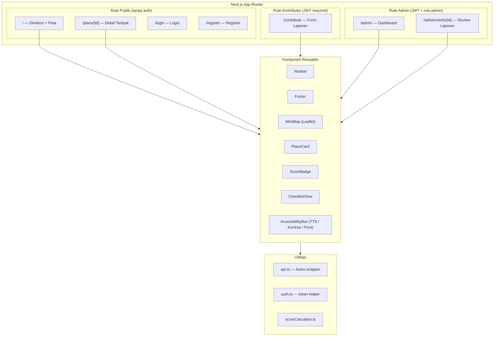
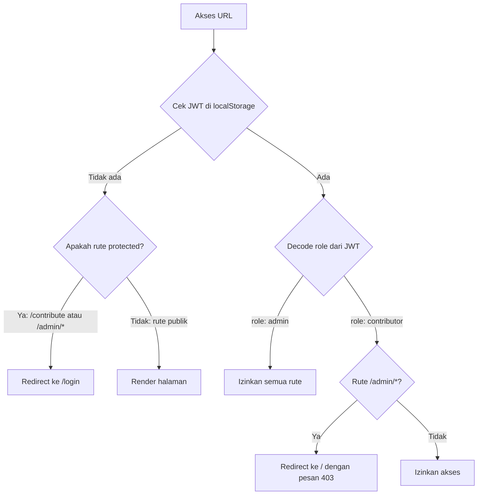
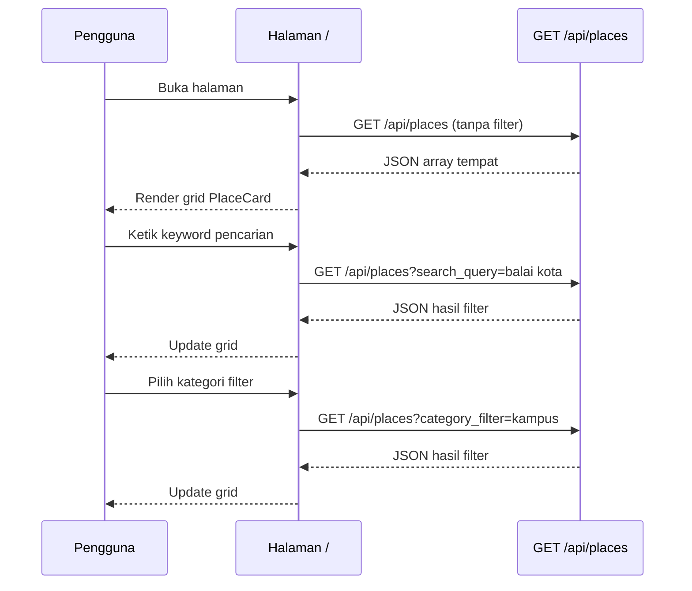
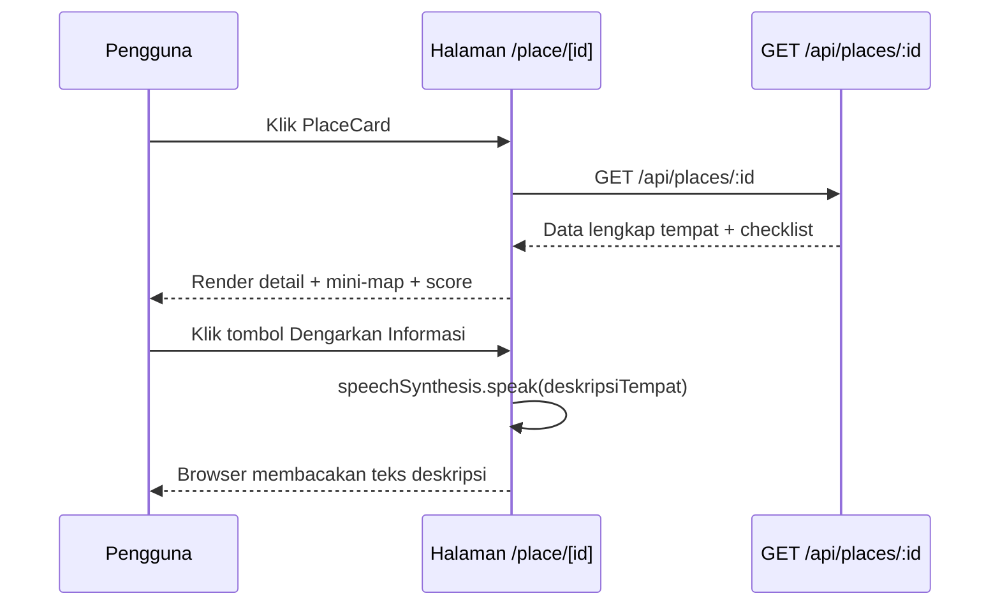
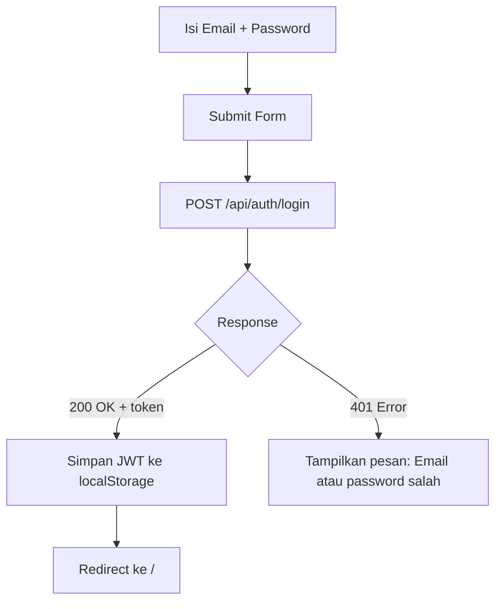
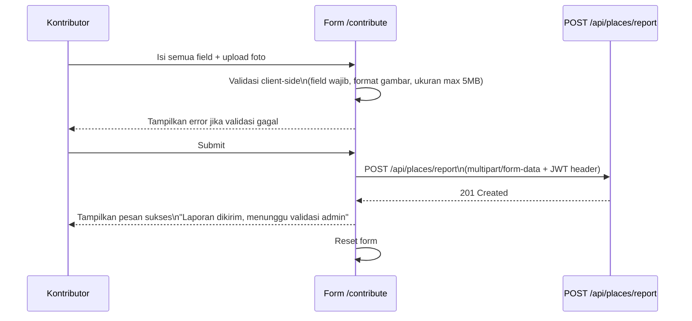
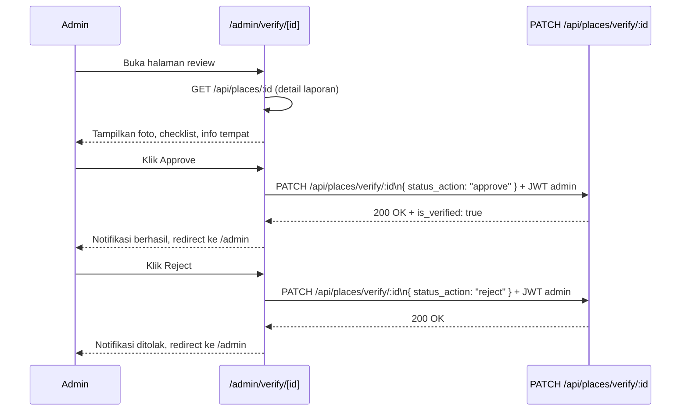
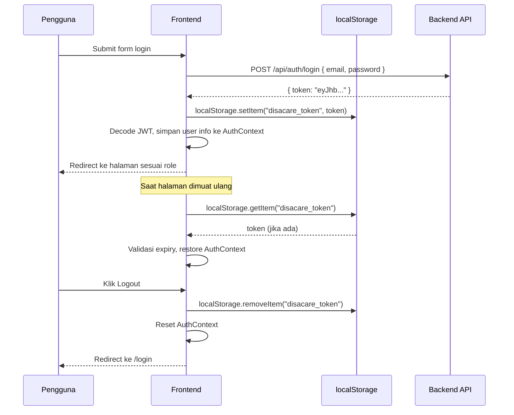
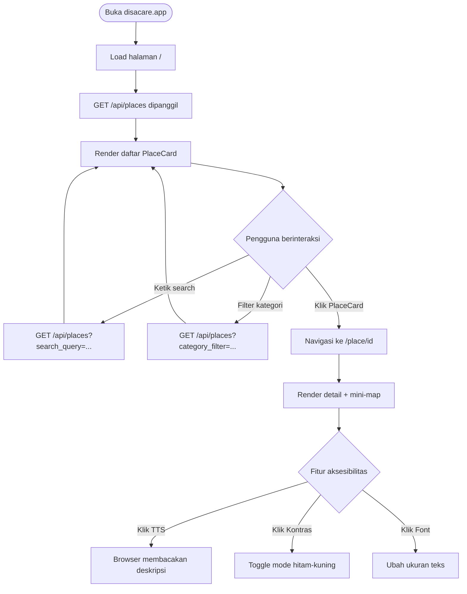
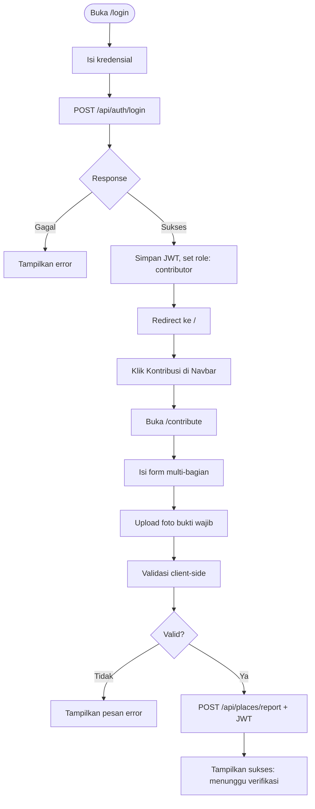

# PRD Frontend — DisaCare Bandung

**Dokumen:** Product Requirements Document — Frontend Layer  
**Aplikasi:** DisaCare Bandung  
**Framework:** Next.js 14 (App Router) + React + Tailwind CSS  
**Versi:** 1.0.0  
**Tim:** Affifah, Alifya, Al Yasmin, Zahra

---

## Daftar Isi

- [Tujuan Dokumen](#tujuan-dokumen)
- [Arsitektur Frontend](#arsitektur-frontend)
- [Struktur Halaman dan Routing](#struktur-halaman-dan-routing)
- [Komponen Global](#komponen-global)
- [Spesifikasi Halaman](#spesifikasi-halaman)
- [Fitur Aksesibilitas UI](#fitur-aksesibilitas-ui)
- [State Management](#state-management)
- [Integrasi API](#integrasi-api)
- [Alur Autentikasi Frontend](#alur-autentikasi-frontend)
- [Workflow Diagram Lengkap](#workflow-diagram-lengkap)
- [Konvensi Kode](#konvensi-kode)

---

## Tujuan Dokumen

Dokumen ini mendefinisikan seluruh kebutuhan dan spesifikasi teknis lapisan frontend aplikasi DisaCare Bandung. Mencakup struktur halaman, komponen, alur pengguna, integrasi API, dan implementasi fitur aksesibilitas UI.

---

## Arsitektur Frontend



---

## Struktur Halaman dan Routing

```
app/
├── layout.tsx                      -- Root layout (Navbar, Footer, AccessibilityBar)
├── page.tsx                        -- Halaman Direktori Utama (/)
│
├── place/
│   └── [id]/
│       └── page.tsx                -- Halaman Detail Tempat (/place/[id])
│
├── (auth)/
│   ├── login/
│   │   └── page.tsx                -- Login (/login)
│   └── register/
│       └── page.tsx                -- Register (/register)
│
├── contribute/
│   └── page.tsx                    -- Form Kontribusi (/contribute) — protected
│
└── admin/
    ├── page.tsx                    -- Dashboard Admin (/admin) — protected
    └── verify/
        └── [id]/
            └── page.tsx            -- Review Laporan (/admin/verify/[id]) — protected
```

### Aturan Route Protection



---

## Komponen Global

### 1. Navbar

Tampil di semua halaman melalui `app/layout.tsx`.

| Elemen | Kondisi Tampil | Keterangan |
|---|---|---|
| Logo DisaCare | Selalu | Link ke `/` |
| Input Pencarian | Selalu | Hanya aktif di halaman `/` |
| Tombol Login | Belum login | Link ke `/login` |
| Nama user + Logout | Sudah login | Baca token dari localStorage |
| Tombol Kontribusi | Role: contributor / admin | Link ke `/contribute` |
| Tombol Admin | Role: admin | Link ke `/admin` |

### 2. AccessibilityBar

Komponen bar tetap (sticky) di bagian bawah layar. Tersedia di semua halaman untuk pengguna umum.

| Kontrol | Fungsi | Implementasi |
|---|---|---|
| Tombol TTS | Membacakan konten halaman aktif | `window.speechSynthesis.speak()` (Web Speech API) |
| Tombol High Contrast | Toggle mode hitam-kuning | Menambah/hapus class `.high-contrast` pada `<body>` |
| Tombol Font+ | Memperbesar ukuran teks global | Manipulasi CSS variable `--base-font-size` |
| Tombol Font- | Mengecilkan ukuran teks global | Manipulasi CSS variable `--base-font-size` |

### 3. MiniMap

Komponen Leaflet.js yang dirender hanya di sisi client (`dynamic import` dengan `ssr: false`).

Props yang diterima:

```typescript
interface MiniMapProps {
  latitude: number;
  longitude: number;
  placeName: string;
  zoom?: number; // default: 16
}
```

### 4. PlaceCard

Kartu ringkasan tempat yang ditampilkan di halaman direktori.

Props:

```typescript
interface PlaceCardProps {
  id: string;
  name: string;
  category: string;
  address: string;
  score: number;        // persentase 0-100
  isVerified: boolean;
  photoUrl?: string;
}
```

### 5. ScoreBadge

Indikator visual persentase aksesibilitas.

| Rentang Nilai | Warna | Label |
|---|---|---|
| 80 — 100 | Hijau | Sangat Aksesibel |
| 50 — 79 | Kuning | Cukup Aksesibel |
| 0 — 49 | Merah | Perlu Perbaikan |

---

## Spesifikasi Halaman

### Halaman 1: Direktori Utama (`/`)

**Deskripsi:** Halaman utama yang menampilkan daftar tempat dengan fitur pencarian dan filter kategori.

**Komponen yang digunakan:** `Navbar`, `PlaceCard`, `ScoreBadge`, `AccessibilityBar`

**Layout:**

```
+--------------------------------------------------+
| NAVBAR                                           |
| [Search Input] [Filter Kategori Dropdown]        |
+--------------------------------------------------+
| GRID KARTU TEMPAT                                |
| [PlaceCard] [PlaceCard] [PlaceCard]              |
| [PlaceCard] [PlaceCard] [PlaceCard]              |
| ...                                              |
+--------------------------------------------------+
| ACCESSIBILITY BAR (sticky bottom)                |
+--------------------------------------------------+
```

**Alur UI:**



**State yang dikelola:**

```typescript
const [places, setPlaces] = useState<Place[]>([]);
const [searchQuery, setSearchQuery] = useState('');
const [categoryFilter, setCategoryFilter] = useState('all');
const [isLoading, setIsLoading] = useState(false);
const [error, setError] = useState<string | null>(null);
```

---

### Halaman 2: Detail Tempat (`/place/[id]`)

**Deskripsi:** Halaman detail satu tempat yang memuat semua informasi aksesibilitas, mini-map, checklist fasilitas, dan tombol TTS.

**Komponen:** `MiniMap`, `ChecklistView`, `ScoreBadge`, `AccessibilityBar`

**Layout:**

```
+--------------------------------------------------+
| NAVBAR                                           |
+--------------------------------------------------+
| [Foto Utama]         | [MINI MAP - Leaflet.js]   |
+--------------------------------------------------+
| Nama Tempat — Kategori                           |
| Alamat Lengkap di Bandung                        |
| [ScoreBadge: 85% Sangat Aksesibel]               |
| [Tombol: Dengarkan Informasi (TTS)]              |
+--------------------------------------------------+
| CHECKLIST FASILITAS                              |
| [v] Ramp Kursi Roda    [x] Toilet Disabilitas    |
| [v] Guiding Block      [v] Parkir Khusus         |
| [x] Pintu Otomatis     [v] Lift/Akses Vertikal   |
+--------------------------------------------------+
| Deskripsi Tempat (dibacakan oleh TTS)            |
+--------------------------------------------------+
| ACCESSIBILITY BAR                                |
+--------------------------------------------------+
```

**Alur UI:**



---

### Halaman 3: Login (`/login`)

**Komponen:** Form dengan input email dan password.

**Alur:**



---

### Halaman 4: Register (`/register`)

**Komponen:** Form registrasi dengan field nama, email, password, dan role (kontributor).

Catatan: Role `admin` tidak dapat didaftarkan melalui form publik. Admin dibuat langsung oleh Developer di database.

---

### Halaman 5: Form Kontribusi (`/contribute`) — Protected

**Deskripsi:** Form multi-bagian untuk mengirim laporan tempat baru. Hanya dapat diakses oleh kontributor dan admin yang sudah login.

**Layout:**

```
+--------------------------------------------------+
| NAVBAR                                           |
+--------------------------------------------------+
| FORM KONTRIBUSI LAPORAN TEMPAT                   |
|                                                  |
| Bagian 1: Informasi Dasar                        |
| [Nama Tempat]                                    |
| [Kategori: Dropdown]                             |
| [Alamat Lengkap]                                 |
| [Latitude] [Longitude]                           |
|                                                  |
| Bagian 2: Checklist Fasilitas                    |
| [ ] Ramp Kursi Roda                              |
| [ ] Toilet Ramah Disabilitas                     |
| [ ] Jalur Guiding Block                          |
| [ ] Area Parkir Khusus                           |
| [ ] Pintu Otomatis / Pintu Lebar                 |
| [ ] Lift / Akses Vertikal                        |
|                                                  |
| Bagian 3: Bukti Fisik                            |
| [Upload Foto — Wajib] [Preview foto]             |
|                                                  |
| [Tombol Kirim Laporan]                           |
+--------------------------------------------------+
```

**Alur UI:**



**Validasi Client-side:**

| Field | Aturan |
|---|---|
| Nama Tempat | Wajib, min 3 karakter |
| Kategori | Wajib dipilih |
| Latitude | Wajib, format angka desimal, range -90 s/d 90 |
| Longitude | Wajib, format angka desimal, range -180 s/d 180 |
| Checklist | Min 1 fasilitas harus dicentang |
| Foto Bukti | Wajib, format jpg/jpeg/png, maks 5 MB |

---

### Halaman 6: Dashboard Admin (`/admin`) — Protected

**Deskripsi:** Halaman daftar laporan yang masuk dan menunggu verifikasi admin.

**Layout:**

```
+--------------------------------------------------+
| NAVBAR (menampilkan: Admin Mode)                  |
+--------------------------------------------------+
| DASHBOARD VERIFIKASI                             |
| Total Menunggu: [N] laporan                      |
|                                                  |
| TABEL ANTRIAN LAPORAN                            |
| Nama Tempat | Kontributor | Tanggal | Aksi       |
| Kedai A     | user@... | 2024-... | [Review]     |
| Taman B     | user@... | 2024-... | [Review]     |
+--------------------------------------------------+
```

---

### Halaman 7: Review Laporan Admin (`/admin/verify/[id]`) — Protected

**Deskripsi:** Halaman admin untuk melihat detail laporan dan memutuskan approve atau reject.

**Alur:**



---

## Fitur Aksesibilitas UI

Fitur ini diimplementasikan menggunakan JavaScript DOM manipulation dan Web Speech API browser. Tidak ada library eksternal tambahan.

### Text-to-Speech (TTS)

```typescript
// components/accessibility/TextToSpeech.tsx

const speak = (text: string) => {
  if (!window.speechSynthesis) return;
  window.speechSynthesis.cancel(); // hentikan suara sebelumnya
  const utterance = new SpeechSynthesisUtterance(text);
  utterance.lang = 'id-ID';
  utterance.rate = 0.9;
  window.speechSynthesis.speak(utterance);
};
```

Teks yang dibacakan pada halaman `/place/[id]`: nama tempat, alamat, persentase aksesibilitas, dan deskripsi fasilitas yang tersedia.

### High Contrast Mode

```typescript
// Menambahkan class ke <body> untuk override CSS global
const toggleHighContrast = () => {
  document.body.classList.toggle('high-contrast');
};

// Dalam globals.css:
// .high-contrast { background: #000; color: #FFD700; }
// .high-contrast a { color: #FFD700; }
// .high-contrast button { background: #FFD700; color: #000; }
```

### Font Resizer

```typescript
// Menggunakan CSS variable yang diterapkan ke root
let currentSize = 16;

const increaseFont = () => {
  currentSize = Math.min(currentSize + 2, 26);
  document.documentElement.style.setProperty('--base-font-size', `${currentSize}px`);
};

const decreaseFont = () => {
  currentSize = Math.max(currentSize - 2, 12);
  document.documentElement.style.setProperty('--base-font-size', `${currentSize}px`);
};
```

### Workflow Fitur Aksesibilitas

```mermaid
flowchart LR
    A[Pengguna klik tombol\ndi AccessibilityBar] --> B{Jenis Aksi}
    B -->|TTS| C[Kumpulkan teks halaman aktif]
    C --> D[speechSynthesis.speak()]
    D --> E[Browser memproses suara]
    B -->|High Contrast| F[Toggle class .high-contrast pada body]
    F --> G[CSS override: background hitam, teks kuning]
    B -->|Font+| H[Naikkan --base-font-size +2px]
    B -->|Font-| I[Turunkan --base-font-size -2px]
```

---

## State Management

DisaCare tidak menggunakan library state management eksternal (Redux/Zustand). Semua state dikelola menggunakan `useState` dan `useContext` bawaan React.

### AuthContext

```typescript
// lib/context/AuthContext.tsx

interface AuthContextType {
  user: User | null;
  token: string | null;
  login: (token: string) => void;
  logout: () => void;
  isAdmin: boolean;
  isContributor: boolean;
}
```

State autentikasi dibaca dari `localStorage` saat aplikasi pertama kali dimuat dan disimpan dalam Context agar dapat diakses dari seluruh komponen tanpa prop drilling.

### AccessibilityContext

```typescript
// lib/context/AccessibilityContext.tsx

interface AccessibilityContextType {
  isHighContrast: boolean;
  fontSize: number;
  toggleHighContrast: () => void;
  increaseFontSize: () => void;
  decreaseFontSize: () => void;
  speak: (text: string) => void;
}
```

---

## Integrasi API

Semua pemanggilan API ke backend menggunakan fungsi wrapper di `lib/api.ts` yang secara otomatis menyisipkan header Authorization jika token tersedia.

```typescript
// lib/api.ts

const BASE_URL = process.env.NEXT_PUBLIC_API_URL;

const apiFetch = async (endpoint: string, options: RequestInit = {}) => {
  const token = localStorage.getItem('disacare_token');
  const headers: HeadersInit = {
    'Content-Type': 'application/json',
    ...(token ? { Authorization: `Bearer ${token}` } : {}),
    ...options.headers,
  };

  const res = await fetch(`${BASE_URL}${endpoint}`, { ...options, headers });
  if (!res.ok) throw new Error(await res.text());
  return res.json();
};

export const placesApi = {
  getAll: (params?: { search_query?: string; category_filter?: string }) =>
    apiFetch(`/api/places?${new URLSearchParams(params as Record<string, string>)}`),
  getById: (id: string) => apiFetch(`/api/places/${id}`),
  report: (formData: FormData) =>
    apiFetch('/api/places/report', { method: 'POST', body: formData, headers: {} }),
  verify: (id: string, status_action: 'approve' | 'reject') =>
    apiFetch(`/api/places/verify/${id}`, {
      method: 'PATCH',
      body: JSON.stringify({ status_action }),
    }),
};

export const authApi = {
  login: (email: string, password: string) =>
    apiFetch('/api/auth/login', { method: 'POST', body: JSON.stringify({ email, password }) }),
  register: (data: RegisterPayload) =>
    apiFetch('/api/auth/register', { method: 'POST', body: JSON.stringify(data) }),
};
```

---

## Alur Autentikasi Frontend



---

## Workflow Diagram Lengkap

### Alur Lengkap Pengguna Umum



### Alur Lengkap Kontributor



---

## Konvensi Kode

### Penamaan File

| Jenis | Konvensi | Contoh |
|---|---|---|
| Halaman | `page.tsx` (Next.js convention) | `app/contribute/page.tsx` |
| Komponen | PascalCase | `PlaceCard.tsx`, `MiniMap.tsx` |
| Hooks | camelCase dengan prefix `use` | `useAuth.ts`, `usePlaces.ts` |
| Utilitas | camelCase | `scoreCalculator.ts`, `api.ts` |
| Style | Tailwind class inline | Tidak ada file CSS terpisah per komponen |

### Struktur Komponen

```typescript
// Contoh struktur komponen standar
'use client'; // jika menggunakan state atau browser API

import { useState } from 'react';

interface ComponentNameProps {
  // definisikan props dengan TypeScript
}

export default function ComponentName({ prop1, prop2 }: ComponentNameProps) {
  // state
  // handlers
  // return JSX
}
```

### Dynamic Import untuk Leaflet

Leaflet tidak mendukung SSR. Selalu gunakan `dynamic import` dengan `ssr: false`:

```typescript
// app/place/[id]/page.tsx
import dynamic from 'next/dynamic';

const MiniMap = dynamic(() => import('@/components/map/MiniMap'), {
  ssr: false,
  loading: () => <div className="w-full h-48 bg-gray-200 animate-pulse rounded" />,
});
```

---

*Dokumen ini adalah bagian dari DisaCare Bandung — Tugas Besar Mata Kuliah Literasi Manusia dan Teknologi*  
*Tim: Affifah, Alifya, Al Yasmin, Zahra*
